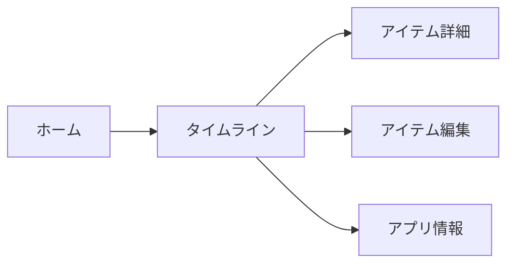

SCREEN_GUIDE.mdを作成または更新してください。
このドキュメントはUIテスト作成時のコンテキストとして使用されます。
mobile-mcp（必須）を使ってアプリを起動し、実際の画面を確認しながらソースコードと照合してください。

## mobile-mcp設定
- **デバイス**: 起動中のシミュレータを優先使用。なければiPhone 16を起動
- WebDriverAgentが未セットアップの場合はユーザーに確認

## ドキュメント構造

以下のセクションを順に記載（**各項目の記述は最大3つまで**）：

### 1. アプリ概要
1文で簡潔に記述
```markdown
例: Minecraftワールド管理アプリ。写真からシード値や座標を認識する機能を持つ。
```

### 2. 実装クラス対比表
3列の表形式
```markdown
| 画面の役割 | 実装クラス名 | セル/コンポーネント |
|-----------|-------------|-------------------|
| タイムライン | TimeLineView | TimeLineCell |
| 写真グリッド | SpotListView | - |
```

### 3. タブ構成
4列の表形式
```markdown
| タブ | タイトル | メイン表示 |
|------|----------|-----------|---------------------|
| ホーム | "ホーム" | タイムライン（リスト形式） |
```

### 4. タブ別機能
各タブごとに主要な操作を**最大3つ**まで箇条書き。
```markdown
### ホーム
- **ナビゲーション右上**: 情報ボタン（iアイコン）→ アプリ情報画面（モーダル）
- **リストアイテムタップ**: アイテム詳細画面へ遷移
- **Pull to Refresh**: リスト更新
```

### 5. 各画面
3列の表形式（画面の役割、タイトル、主要機能）
```markdown
| 画面の役割 | タイトル | 主要機能 |
|-----------|---------|---------|
| アイテム詳細画面 | - | 写真/シード値/座標の表示、編集・削除操作 |
```

### 画面遷移図図
主要な画面のみ、３階層くらいまで


## 記述ルール

### 役割ベースで記述
- メインコンテンツは画面の**役割**で記述（例: "アイテム詳細画面"、"タイムライン"）
- 実装クラス名は**対比表にのみ**記載（他の箇所には絶対に書かない）
- 必要最小限の情報のみ記載（AIエージェントが理解できる最小限度）

### 必須項目
- タブ構成（タブ名、数、タイトル）
- 各画面の構成要素（ナビゲーションバー、ボタン、リスト/グリッド等）
- 操作可能な要素（タップ、スワイプ、入力フィールド、チェックボックス等）
- 画面遷移図（どの操作でどの画面に遷移するか、モーダル/シート表示の区別）
- 実装クラス対比表（画面の役割 ↔ 実装クラス名）

### 含めない情報
- ViewModel、UseCase等のアーキテクチャ詳細
- ビジネスロジックの実装詳細
- 冗長な説明や補足

## 注意事項

- 表形式を活用して情報を構造化
- 冗長な表現を避け、簡潔に記述
