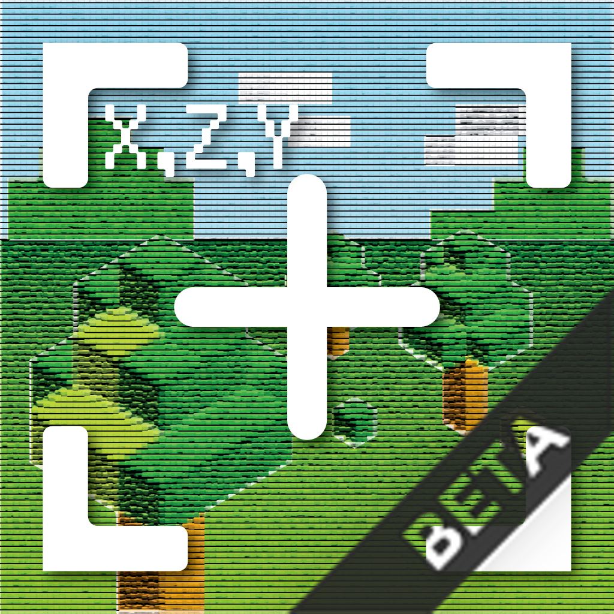

# ios-archi

技術的な検証など自由に試すためのアプリ

> お試し用のプロジェクトなので、あえてレガシーな技術を使っていたり、悪いコードで書いていたりしています。  
> レガシーな技術を使っていたり悪いコードで書いているところは、挙動を確認したりリファクタの方法を試したりするのが主な目的です。

Using
- MVVM + レイヤードアーキテクチャ
- Combine
- WebKit
- Swift concurrency
- Xcode Cloud
- SwiftUI
- CoreData
- XCConfig
- Swift Package Manager
- CocoaPods
- SPMを用いたマルチモジュール構成
- DIコンテナ
- Swift-dependencies
- ドメイン駆動設計 (DDD) 戦術的設計
- テストコード（Swift-dependencies）
- テストコード（Quick/Nimble）
- VisionFramework
- SwiftLint
- SwiftFormat
- bundler
- rbenv
- Xcode Preview
- Sourcery（テストコードのボイラープレート自動生成）
- Firebase Analytics
- Firebase Crashlytics
- etc

Planning to use
- APIKit
- Renovate（ライブラリの自動生成）
- Cloud Vision API
- エラーハンドラー
- CloudKit or Firebase Realtime Database （端末間でのデータ同期）
- PageObjectデザインパターン（UIテスト）
- Firebase Cloud Messaging
- Firebase Remote Config
- Github Actions
- DangerSwift
- etc

Want to use
- MLKit
- TCA（マルチモジュール）
- etc

※ 作りたいアプリのイメージをベースにリストアップしているが、それ以外にも使いたい技術はある

 
 

