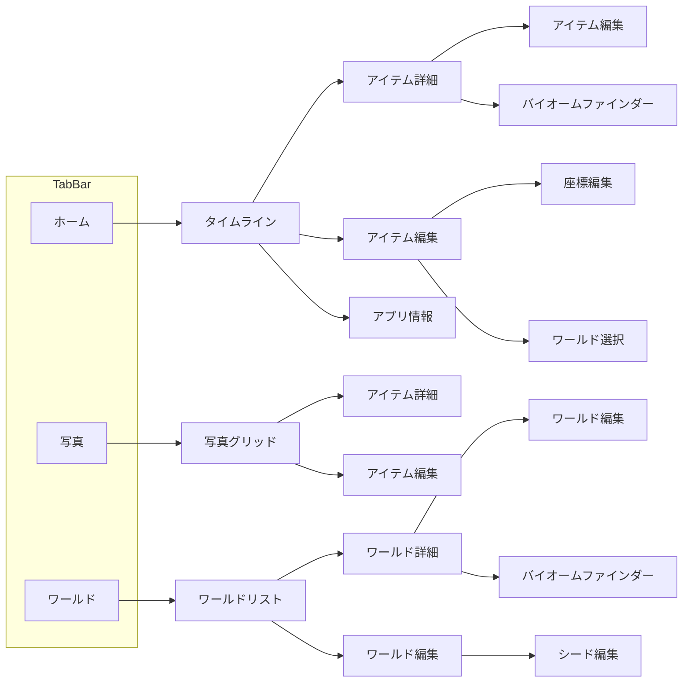

# SCREEN_GUIDE.md

## 1. アプリ概要

Minecraftワールド管理アプリ。写真からシード値や座標を認識し、ワールド情報を管理する機能を持つ。

## 2. 実装クラス対比表

| 画面の役割 | 実装クラス名 | セル/コンポーネント |
|-----------|-------------|-------------------|
| タイムライン | TimeLineView | TimeLineCell |
| 写真グリッド | SpotListView | SpotListCell |
| ワールドリスト | WorldListView | WorldListCell |
| アイテム詳細 | ItemDetailView | - |
| ワールド詳細 | WorldDetailView | - |
| アイテム編集 | ItemEditView | SpotImageEditCell |
| ワールド編集 | WorldEditView | - |
| アプリ情報 | AppInfoView | - |
| バイオームファインダー | BiomeFinderView | - |
| 座標編集 | CoordinatesEditView | - |
| シード編集 | SeedEditView | - |
| ホームタブラッパー | HomeView | - |
| 写真タブラッパー | PhotoView | - |
| ワールドタブラッパー | ListView | - |

## 3. タブ構成

| タブ | タイトル | アイコン | メイン表示 |
|------|----------|---------|-----------|
| ホーム | ホーム | house | タイムライン（リスト形式） |
| 写真 | 写真一覧 | photo.stack | 写真グリッド |
| ワールド | ワールド一覧 | globe.desk | ワールドリスト |

## 4. タブ別機能

### ホーム
- **ナビゲーション右上**: 情報ボタン（info.circle.fill）→ アプリ情報画面（シート）
- **リストアイテムタップ**: アイテム詳細画面へ遷移
- **FloatingButton**: アイテム編集画面（シート）で新規作成

### 写真
- **グリッドアイテムタップ**: アイテム詳細画面へ遷移
- **FloatingButton**: アイテム編集画面（シート）で新規作成
- **フィルター**: 画像付きアイテムのみ表示

### ワールド
- **リストアイテムタップ**: ワールド詳細画面へ遷移
- **スワイプ削除**: ワールドの削除（確認ダイアログ表示）
- **FloatingButton**: ワールド編集画面（シート）で新規作成

## 5. 各画面

| 画面の役割 | タイトル | 主要機能 |
|-----------|---------|---------|
| タイムライン | ホーム | アイテムリスト表示、画像フィルター、Pull to Refresh |
| 写真グリッド | 写真一覧 | アイテムグリッド表示、画像フィルター、Pull to Refresh |
| ワールドリスト | ワールド一覧 | ワールドリスト表示、スワイプ削除、Pull to Refresh |
| アイテム詳細 | 詳細 | 写真/座標/ワールド情報表示、編集/バイオーム検索 |
| ワールド詳細 | 詳細 | タイトル/シード値表示、編集/バイオーム検索 |
| アイテム編集 | 新規/編集 | 写真選択、座標入力、ワールド選択、削除 |
| ワールド編集 | 新規/編集 | タイトル入力、シード値入力、削除 |
| アプリ情報 | - | バージョン/ビルド番号表示 |
| バイオームファインダー | - | ChunkBaseでバイオーム検索（WebView） |
| 座標編集 | - | X/Y/Z座標入力 |
| シード編集 | - | シード値入力 |

## 6. 画面遷移図

## 7. 共通コンポーネント

| コンポーネント | 用途 |
|--------------|------|
| FloatingButton | 新規作成ボタン（右下固定） |
| FilterConditionCell | 画像フィルターチェックボックス |
| ImagePicker | 写真選択（カメラ/ライブラリ） |

## 8. モーダル/シート一覧

| 表示元 | モーダル種別 | 表示内容 |
|--------|------------|----------|
| タイムライン | Sheet | アプリ情報、アイテム編集 |
| 写真グリッド | Sheet | アイテム編集 |
| ワールドリスト | Sheet, Alert | ワールド編集、削除確認 |
| アイテム詳細 | Sheet | アイテム編集、バイオームファインダー |
| ワールド詳細 | Sheet | ワールド編集、バイオームファインダー |
| アイテム編集 | Sheet, Dialog | 写真選択、確認ダイアログ |
| ワールド編集 | Dialog | 確認ダイアログ |
