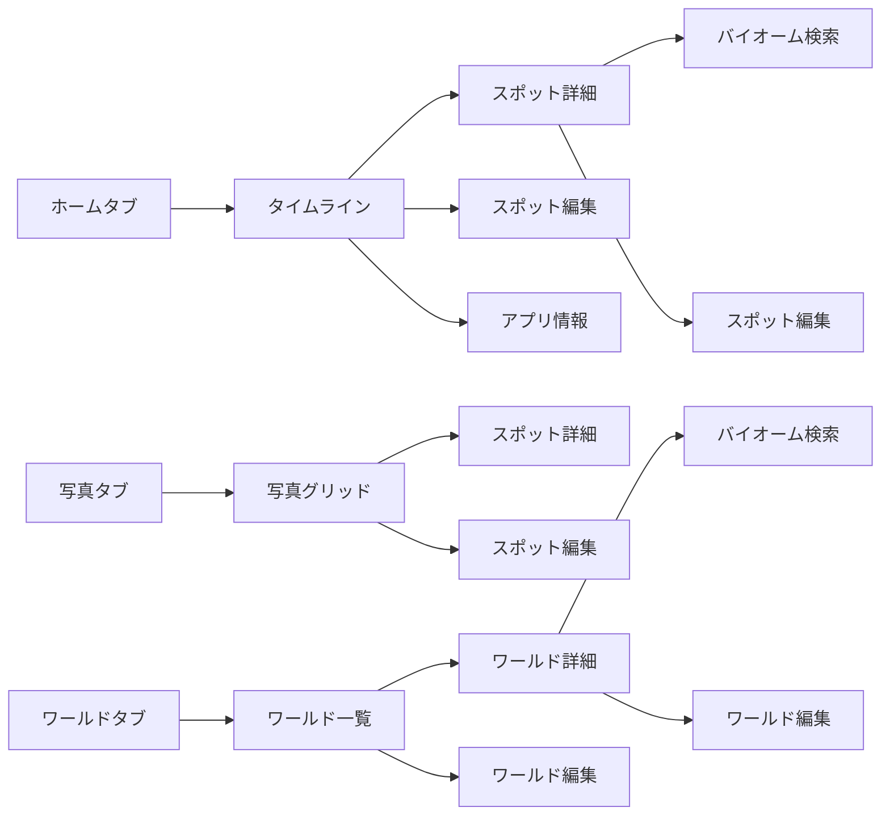

# SCREEN_GUIDE

## 1. アプリ概要
Minecraftワールド管理アプリ。写真からシード値や座標を認識し、スポットとワールドを管理する。

## 2. 実装クラス対比表

| 画面の役割 | 実装クラス名 | セル/コンポーネント |
|-----------|-------------|-------------------|
| タイムライン | TimeLineView | TimeLineCell |
| 写真グリッド | SpotListView | SpotListCell |
| ワールド一覧 | WorldListView | WorldListCell |

## 3. タブ構成

| タブ | タイトル | メイン表示 |
|------|----------|-----------|
| ホーム | "ホーム" | タイムライン（リスト形式） |
| 写真 | "写真一覧" | 写真グリッド（グリッド形式） |
| ワールド | "ワールド一覧" | ワールドリスト（リスト形式） |

## 4. タブ別機能

### ホーム
- **ナビゲーション右上**: 情報ボタン（iアイコン）→ アプリ情報画面（シート）
- **リストアイテムタップ**: スポット詳細画面へ遷移
- **Pull to Refresh**: リスト更新
- **右下フローティングボタン**: スポット登録シート表示

### 写真
- **チェックボックス**: 画像のあるアイテムのみ表示
- **グリッドアイテムタップ**: スポット詳細画面へ遷移
- **Pull to Refresh**: リスト更新
- **右下フローティングボタン**: スポット登録シート表示

### ワールド
- **リストアイテムタップ**: ワールド詳細画面へ遷移
- **スワイプ削除**: ワールド削除（確認アラート表示）
- **Pull to Refresh**: リスト更新
- **右下フローティングボタン**: ワールド登録シート表示

## 5. 各画面

| 画面の役割 | タイトル | 主要機能 |
|-----------|---------|---------|
| スポット詳細 | "スポット詳細" | 写真/座標/ワールド情報の表示、バイオーム検索、編集ボタン |
| ワールド詳細 | "ワールド詳細" | タイトル/シード値の表示、バイオーム検索、編集ボタン |
| アプリ情報 | - | アプリ情報表示（シート） |

## 6. 画面遷移図

